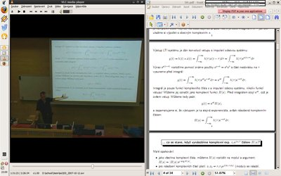

Title: Jak se učit, post scriptum
Date: 2008-01-30 01:26:00
Tags: management, škola

Konec zkouškového! [První článek o učení](http://blog.javorek.net/2007/11/17/jak-se-ucit/) jsem psal v půlce semestru a zahrnoval spíše nějaké základní postřehy, jež by zřejmě mohly pomoci. Nyní mám v rukávu postupy, jež mne **dovedly ke zdárným výsledkům**. Tedy asi spíše k výsledkům než zdárným, ale to by přeci neznělo tak hezky a důvěryhodně ;) .

## Nekoukejte do světla

Když čtete z monitoru nebo spíše displeje, **stáhněte si jas**, protože vaše oči namáháte podobně, jako byste se několik hodin koukali do žárovky a zkoušeli z ní přečíst výkon (ano, přeháním, ale princip je stejný).

## Pište si tahák

Skvělá věc! Nejen že je u některých zkoušek povoleno mít nějaké papírové materiály s sebou, ale navíc je to unikátní způsob, jak **vstřebat informace** např. z mnoha PDF, ačkoliv tahák potom třeba nikdy už nevyužijete.

-   při čtení se musíte soustředit, protože filtrujete text a přemýšlíte, co je důležité, co si vypsat
-   u psaní se špatně usíná
-   přemíláním informací v mozku při psaní a filtraci tyto údaje vstřebáváte a v hlavě vám zůstávají větší či menší sedimenty učiva, jež dávají kvalitní základ a rámcový přehled
-   když si budete taháky po sobě číst při učení, mozek si při této činnosti vybavuje událost psaní a opět v tom okamžiku propírá učivo, takže vzniknou další sedimenty
-   díky tomu, že jste si tento výukový materiál vytvořili sami, hned víte, kde máte hledat jakou informaci, pokud ji nevíte

**Poznámka:** sdílet taháky s ostatními je nesmysl, protože pro ně mají minimální hodnotu. Vlastnoruční tahák **nelze nahradit**.

## Vzduch!

Teplo vybízí ke spánku. Je venku zima? **Pořádně vyvětrejte!** Trochu chladu snesete. A samozřejmě větrejte pravidelně. Čerstvý vzduch podněcuje funkčnost myšlení a tlumí ospalost.

## Nonstop je nesmysl

Učit se nonstop není efektivní. Dělejte si **přestávky**. Stejně tak se v noci učit bez jediné hodiny spánku je prudce neefektivní – nejméně 2 hodiny z noci se stejně nebudete schopni dobře soustředit (tzv. největší krize) a buď budete usínat, nebo vibrovat zorničkami v jiných dimenzích. Pokud dochází energie, **běžte si na hodinku lehnout**, zajděte si do sprchy a pokračujte.

## Sprcha = spánek

Nevím jak u jiných, ale po sprše se mi vždy **chtělo spát**, ať už byla studená nebo teplá. Je to zrádné, zdálo by se, že sprcha naopak probudí. Jenže tělo se tak nějak promočí, unaví, uklidní… Proto doporučuji tento sport provozovat buď v rozumnou večerní hodinu, nebo ráno, před zkouškou. Ráno nebo **po probuzení naštěstí sprcha uspávací efekt ztrácí** :) . V noci je to smrtící past.

## Hýbejte se!

**Fyzická zátěž** uleví vašemu mozku, posílí tělo a prokrví, nabudí vás, budete **lépe myslet**. Nebudete spát. Jděte si [zaběhat](http://blog.javorek.net/2007/08/16/run-forrest-run/) (ta hodinka vás nezabije), udělejte si v přestávce pár dřepů nebo kliků a myslete na jiné věci než třeba na rovnice. Protáhněte si tělo, **zaskákejte na oblíbený song** a pak se vraťte k učení :) .

## Jezte a pijte

Nehrajte si na poustevníka. Nedostatek jídla je sužující a [hlad](http://hlad.javorek.net) **odvádí pozornost od soustředění**. Pít lze často snadno zapomenout, ale není to dobré, protože myšlení podle mne prospívá spíše **zvýšený přísun tekutin**.

## Zdraví především

Lze udělat nocovku i **bez** kofeinu a jiných **podpůrných látek**. Bez čaje, kávy, guarany, energiťáků… Jde to a přijde mi to o dost zdravější. Navíc, povzbuzovače způsobují energetický zážeh, ale brzy po něm přichází velký útlum. Udržujte dobrou náladu, dopřejte si fyzický pohyb, zdravě se prospěte alespoň několik hodin. Budu se opakovat, ale i psychicky mnohem lépe působí, když máte do začátku písemky ještě dva dny a už teď umíte přes polovinu látky ;) . **Méně stresu, více pohody a sebedůvěry.** Takže… Učte se **dřív**, je to zdravé.

## Internet off

Pokud můžete, stáhněte si relevantní záznamy z přednášek nebo cvičení, sežeňte si materiály ke studiu (snažte najít efektivních 20%) a pak **odpojte** počítač od internetu. **Je nutné vytáhnout kabeláž.** Opravdu. A věřte mi, má to skvělé výsledky.

## Biorytmus

Jednoduše – pokud víte, že se mezi půlnocí a třetí ráno naučíte víc než dopoledne, kdy vám to prostě na učení vůbec nesedí a nedokážete se soustředit, choďte spát ve tři a vstávejte na oběd. Je jen na vás, jak si **uspořádáte den**.

## Vynález nové doby: biograf, pánové a dámy!

Pokud vaše fakulta tvoří **videa z přednášek**, pak máte úžasný zdroj učiva navíc. Skvělý zdroj. Ale pozor!

**Streaming** je vesměs škodlivý – místo aby šel student na přednášku, pustí si ji z kolejí a kouká. Přednáška je nudná, takže se na ni nekouká a raději během toho začne něco dělat na internetu, více a více, až se zcela nesoustředí a jen omylem si všimne, že *už mu tam na pozadí nikdo nemluví*. To ho nakonec přesvědčí o tom, že není třeba streaming ani zapínat → škole se vůbec nevěnuje. Doporučuji chodit na přednášky.

Video jako záznam je mnohonásobně **přínosnější**. Můžete si pustit přednášku, kterou jste **nestihli**, můžete si pustit již viděnou přednášku pro **zopakování** před písemkou (to je překvapivě velmi efektivní), můžete si stáhnout cvičení s **vysvětlením složitého postupu** a pozastavovat si video po pár vteřinách či posouvat jej tam a zpět tak dlouho, než věc pochopíte. Přednáška spuštěná **zrychleně** může být navíc stejně informačně hodnotná, ale zabere méně času.

## Takže hodně štestí…

…těm, kteří mají nějaká muka ještě před sebou ;) .