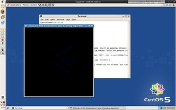

Title: Vzdálený přístup i z Windows
Date: 2008-03-12 13:09:00
Tags: linux, software, windows

Nemám Linux na počítači, nepohnul jsem CD/DVD mechanikou, flashka
leží 30 cm od mého notebooku a přesto, přesto všechno jsem dnes na
Linuxu kompiloval pár svých programů, spouštěl Firefox a četl PDF
soubory. Jak jsem to dokázal? **Vzdáleně jsem se připojil** na
školní server :) .

## PuTTY

Pokud se chce někdo **z Windows připojit na Linux** (či jinou
mutaci UNIXu), má většinou v paměti šikovný prográmek, PuTTY. Jeden
exe soubor a umí to divy. Více o PuTTY na
[oficiálním webu](http://www.chiark.greenend.org.uk/~sgtatham/putty/).
Pokud se vám zdá původní PuTTY zaprášené a ohrané, zpestřete si
život jeho **sexy variací**
[PuTTY Tray](http://alian.info/index.php?option=com_content&task=view&id=1533).

## SSH

Chcete se připojovat z příkazového řádku ve Windows stejně jako to
děláte na Linuxu? Chcete, aby vám stačilo pouhé

    ::bash
    ssh <server> -l <login>

a mohli jste se hned poté oddávat orgiím v bashi uprostřed vod
`cmd.exe`? Nainstalujte si
[SSH pro Windows](http://sshwindows.sourceforge.net/). Příkaz `ssh`
vám potom bude fungovat jednoduše i ve vašem okenním systému.
Samozřejmě nemusíte SSH využívat jen pro připojení jinam, můžete si
jednoduše
[podle návodu](http://pigtail.net/LRP/printsrv/cygwin-sshd.html)
rozběhat **svůj SSH server** na Windows a vzdáleně se třeba ze
školy **připojovat na svůj počítač** (pokud bude zapnutý :) ).

## Cygwin

Nestačí? Dobrá, dobrá… Přichází na řadu zabiják všech nedostatků
Windows oproti UNIXům, **Cygwin**. Nebudu se rozepisovat co je
[Cygwin](http://www.cygwin.com/) nebo jak se instaluje. Psali o něm
[na Rootu](http://www.root.cz/clanky/cygwin-unix-ve-windows/), snad
docela srozumitelně
[na JPW](http://www.jakpsatweb.cz/clanky/instalace-cygwin.html) a
samozřejmě
[se o něj otřel i Radek](http://myego.cz/item/cygwin-linux-pod-windows).
Cygwin je zabijákem především proto, že nemusíte instalovat do
Windows všechny ony UNIXové věci zvlášť. Máte
**jeden balík emulující UNIX**, z nějž odebíráte a do nějž
přidáváte prográmky pomocí jednoho `setup.exe` a netrápíte se
s instalací MinGW, SSHWindows atd. Když budete šikovní na
**stránce výběru aplikací** během instalace Cygwinu, budete mít
v systému `make`, `gcc`, `ssh`…

Já jsem si navíc nainstaloval Cygwin na `C:\UNIX`, hned vedle
`C:\WINDOWS` a složku `C:\UNIX\bin` jsem si přidal do PATH Windows,
abych mohl cygwinovské prográmky spouštět odkudkoliv.

## Cygwin/X

Jak jsme si ale s Cygwinem polepšili ve vzdáleném připojení? Nu,
nijak zvlášť ne – `ssh` je tam stejné jako v SSHWindows. Kouzelný
Cygwin však přece nabízí něco navíc. Pokud při instalaci vyberete
balík s portem [Xek](http://www.x.org/) na Cygwin, takzvaným
[Cygwin/X](http://x.cygwin.com/), můžete se připojit **graficky**
(jestli vám to povolí server), pomocí
[XDMCP](http://en.wikipedia.org/wiki/X_display_manager#X_Display_Manager_Control_Protocol).
[Oficiální návod](http://x.cygwin.com/docs/ug/using-remote-session.html)
je samozřejmě k dispozici, ale pokusím se to vysvětlit lidsky.

1.  Na obrazovce *select packages* instalace Cygwinu klikejte na
    slovo *Default* u balíku X11 tak dlouho, až se místo něj objeví
    *Install*.
2.  Dokončíme instalaci.
3.  Spustíme si konzoli Cygwinu a zaútočíme na ni s následujícím
    příkazem:

    XWin.exe -query <server>

4.  Měl by se vám začít vzdáleně spouštět desktop manager
    s přihlašovacím ok­nem.

Jak to vypadá?

Popravdě, k ničemu jinému užitečnému Xka na Cygwinu využít nelze.
Myslím si, že je to ale (alespoň pro mne) dostatečný přínos
k jejich instalaci :) . Přeji příjemnou zábavu.

## A propos, co FIT?

Pro studenty FIT jen závěrečnou poznámku – osobně se mi takto
graficky podařilo připojit jen na Merlina. Jiným se navíc nedaří
připojovat se z míst mimo školní síť. Psal jsem e-mail
administrátorům linuxových serverů a odpověď je takováto:

> …na eve nebezi XDMCP server, pristup na merlina je omezen na sit
> VUT protoze generuje znacny traffic a predevsim se jedna
> o nezabezpeceny datovy tok.

Druhý den však přišla ještě odpověď od inženýra Lampy:

> Vzhledem k male bezpecnosti X protokolu a XDMCP se dnes obvykle
> pouziva pro vzdalene pripojeni ssh X11 forwarding.

Na fórech po internetu jsem pak zjistil, jak na Cygwinu X11
forwarding rozběhat. Je to docela jednoduché…

1.  V terminálu Cygwinu napíšeme `xstart`, abychom si spustili svá
    lokální Xka.
2.  Ve spuštěném xtermu napíšeme upravený příkaz pro SSH
    (přepínač -Y)

    ::bash
    ssh -Y <server> -l <login>

3.  Jsme na vzdáleném serveru a můžeme spouštět grafické aplikace.
    Podařilo se mi na zkoušku spustit `xterm`, `gvim`, `firefox`.

A je to :) . Dle mého skromného názoru by toto mělo jet i mimo
rozsah IP adres VUT Brno.