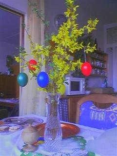
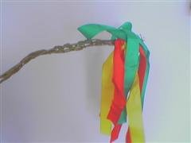
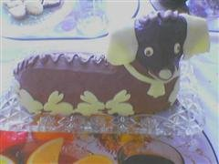

Title: Czech & Slovak Easter Customs: Yes, We Really Beat Girls!
Date: 2009-04-03 14:20:00
Tags: anglicky, erasmus

Today I have met many people, who couldn't believe me my stories
about **Czech and Slovak Easter customs**, especially when I said
we beat girls. But let's start from the beginning, there are more
surviving pagan customs in our brother countries. The most popular
one is definitely the colouring and decorating of eggs.

## Decoration of eggs

{: .right }Professionals in the
art of **egg-decorating** can turn eggs into genuine works of art,
decorating them with straw, wax or bobbin lace. They usually use
egg shells from which the raw yolk is blown through two opposite
holes poked in the top and bottom. Normal people, especially
families with children, prefer to decorate hard-boiled eggs, which
are less fragile. The most common method of decorating is dying the
eggs with onion skins, which makes their colour deep brown. During
the communist days, it was also common to use fabric dye. Nowadays,
children have a vast variety of colours and stickers to
choose from.

## Whipping of women and dousing them with water

{: .left }Another popular pagan
tradition surviving to these days is the
**whipping of women and girls**. The whip or „pomlázka“ is braided
from three or more willow rods. Actually, in every region of our
two states it's called in a different way – „švihačka“, „mrskačka“,
„čagan“, „karabina“, „korbáč“, „tatar“, „žíla“… Pagan Slavs
believed that whipping brought good luck, wealth and a rich harvest
for the whole year. Its original purpose and symbolic meaning is
**to chase away illness and bad spirits and to bring health and youth for the rest of the year to everyone who is whipped**
with the young pussywillow twigs. B.oys would whip girls lightly on
the legs and possibly **douse them with water**.

## Easter carols and Christian traditions

Traditional whipping should be accompanied by the singing of
**Easter carols**. Unlike Christmas carols, they are not that
well-known. Carolling is also accompanied by the sound of the
clapper and rattle, an activity definitely more enjoyed by children
than by their parents. According to the Christian tradition, all
the bells are rung on Green Thursday and then they are silenced
until White Saturday. Meanwhile, their toll is replaced by the
clapper and rattle.

## Eggs, candy, lamb cake and shots of home brew

{: .left }**Girls and women present the carollers with eggs**,
the pagan symbol of life and fertility. But apart from eggs – real
and chocolate ones, Easter is also associated with other foods,
mainly with lamb. These days lamb is rarely eaten in the Czech
Republic but it still appears on Easter tables – in the form of a
cake – with eyes made of raisins or cloves and a green twig in its
mouth… It's also very usual to present whipping men by shots of
home brew.

## Some videos and more information

-   [Traditional willage Easter](http://www.youtube.com/watch?v=pMYU4fcuVpc&feature=related)
-   [Water](http://www.youtube.com/watch?v=7PHNftjjgp4&feature=related)
-   [Boys whipping girls](http://www.youtube.com/watch?v=zT_41piXK3s)

You can see some beautiful
[decorated eggs also just by Google Search](http://images.google.com/images?q=kraslice&oe=utf-8&rls=org.mozilla:cs:official&client=firefox-a&um=1&ie=UTF-8&sa=N&hl=cs&tab=wi).

Article inspired mostly by
[this](http://www.radio.cz/cz/clanek/102218) and also by
[this](http://www.myczechrepublic.com/czech_culture/czech_holidays/easter/).

## So, girls at Otokylä, please…

Be ready on Easter Monday. Girls, please prepare for us, Czech and
Slovak guys,
**eastern eggs, candy, shots of home brew and ribbons**. Thank you!
And remember: It's for your **health**!