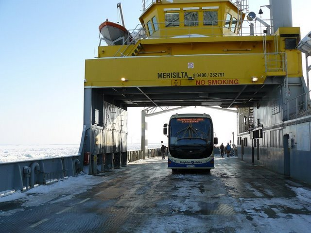
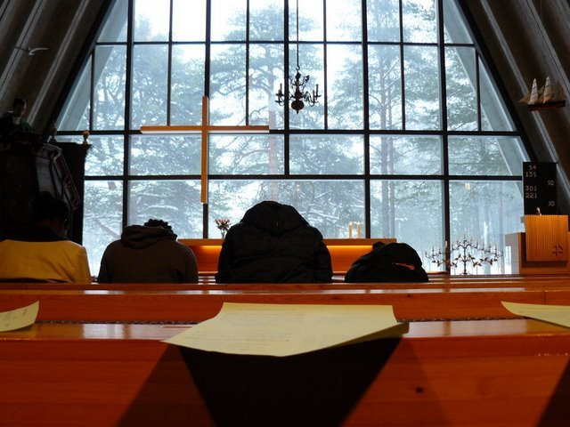

Title: Výlet na Hailuoto
Date: 2009-04-14 12:21:00
Tags: erasmus, finsko, názory, zážitky

Je duben a já jsem o svých výletech psal naposledy před hodně
dlouhou dobou. Pokusím se to
**dohnat a začít zase psát o tom, co se děje právě teď**. První
z výletů, které jsem na blog už nějak nezaznamenal, byl den na
**ostrově Hailuoto**.

Hailuoto je poměrně hodně velký ostrov v Botnickém zálivu. Nachází
se u Finské pevniny, **přímo naproti Oulu** a většinou jde rozeznat
i z mapy celé Evropy. Normálně se na něj musíte dopravit pomocí
kyvadlové trajektové dopravy, ale teď v zimě, kdy je moře zamrzlé,
**funguje mezi pevninou a ostrovem úplně normální silnice**. Ta se
denně měří a pokud by tloušťka ledu klesla pod 40 cm, zavřeli by
ji. Nicméně to ani nyní v dubnu moc nehrozí. Trajekty jezdí
celoročně, protože např. autobusy po silnici přes led jezdit moc
nesmí, jsou těžké.

Výlet byl **pořádán zdejší evangelickou církví**, takže z ostrova
jsme viděli hlavně kostel. Což ani moc nevadí, jelikož na ostrově
prakticky nic jiného není (prostě nějaké normální vesnice :) ).
V kostele jsme se najedli a pak jsme šli ven, hrát různé hry a
soutěže, například fotbal v hlubokém sněhu nebo závody na
odkopávacích sáňkách. Bylo to super odpoledne sněhových radovánek
:) . Potom nám dopřáli jednu bohoslužbu/mši/…? (nevyznám se v tom,
viděl jsem něco takového poprvé v životě a přišlo mi to docela
srandovní) a potom už jsme jeli domů.

Během závěru v kostele se venku strhla sněhová bouře, naopak po
cestě tam a celé odpoledne krásně svítilo sluníčko. Poprvé v životě
jsem **stál na zamrzlém moři**, viděl jsem
**silnici přes zamrzlé moře**, vezl se **trajektem**… Já ani u toho
moře předtím moc nebyl, takže pro mě bylo nové celé to
**cestování lodí**, pocit, že jsem na **ostrově** apod. Poprvé
v životě jsem nebyl v kostele jako turista a poprvé jsem viděl
nějaký **křesťanský obřad**. Připadal jsem si zvláštně a očima
křesťanskou kulturou nepoznamenaného člověka mi to přišlo asi
stejné jako záběry National Geographic ze života afrických kmenů
nebo tibetských mnichů. Samozřejmě nic proti, mě věřící a víra
nevadí – jen to pozoruju jako **divák**. Já určitě taky musím
někomu připadat zvláštní, když se oddávám
[tomu svému náboženství](http://www.hc-kometa.cz/).

Finské **moderní kostely** jsou, co jsem si tak všiml, dost
**spjaté s přírodou**. Mají velké prosklené části apod. Nevím proč,
ale ta zdejší protestantská víra mi přijde mnohonásobně
**sympatičtější než katolická**. Bavil jsem se s Finy a ptal se je,
jak přistupují ke své víře, jestli chodí do kostela, co pro ně
jejich víra znamená apod. a pokud bych si měl představit, že věřím
v Boha, asi by mi přišel přirozenější tento jejich způsob. Přijde
mi to jako opravdu něco, co je
**mezi člověkem a nebem, mezi člověkem a Bohem, mezi člověkem a přírodou**.
Katolická větev na mě naopak působí se svou papežskou církví,
majestátností, mocenstvím, příkazy a zákazy jako hnutí, jež se
vydalo nějakým zvláštním, restriktivním, zvráceným směrem.