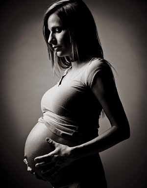

Title: Právo na život
Date: 2009-09-20 12:13:00
Tags: názory

Jsou potraty správné? Měly by být legální? Pokusím se odpovědět a
hned na úvod sdělím, že nevím proč zrovna teď. Jsem po psychicky
náročném týdnu, víkendu prospaném v nemoci a asi mám chuť vyčistit
si mozek psaním o problémech jiných lidí a nechci se stát slavným,
tak si navíc vybírám „neaktuální“ téma :) . Každopádně mi tu toto
téma **leží rozepsané už hodně dlouho**, stejně asi jako článek
o křesťanství. Dokonce se mi některé odkazované články začaly
propadat v historii Internetu.

{: .right } Po osvětlení, proč
mám potřebu psát o tomto tématu, předložím hned na úvod
**svůj názor**. Podle mě je většina argumentace odpůrců potratů
založená na slovíčkaření, definování pojmů a na suchém
**nábožensko-právním teoretizování** o tom, co je správné a co
špatné. Škoda, že naše křesťanská kultura nemá podobně inteligentní
symboly jako čínská filosofie, protože bychom si možná všichni
uvědomovali jasněji, že **nic není černé, nebo bílé**, Jin,
nebo Jang.

Nelze předložit otázku, zda jsou potraty dobré nebo špatné, asi
jako takto nelze uvažovat o žádné z věcí, které máme k dispozici.
I příborem se mohu najíst, ale mohu také zabít. Potrat je jistě
silný nástroj, ale je třeba si uvědomit, že **je to jen nástroj**,
určité východisko. A jistě není žádná žena, která by jej brala na
lehkou váhu – potrat není operace přirovnatelná k nekonečnému
chození do banky pro peněžní půjčky a vytváření nezodpovědných
dluhů. Nemyslím si, že by docházelo k neuváženým potratům. Spíše
k neuváženým početím.

Potrat má svá negativa a svá pozitiva. Negativa všichni známe a
i žena, která se chystá potrat podstoupit, o nich ví. Pozitiva bych
viděl v tom, že
**může vyřešit bezvýchodnou situaci v životě ženy nebo páru**. Od
zdravotních důvodů, přes důvody existenční, ekonomické, po důvody,
které **by ruinovaly život samotnému dítěti, kdyby se narodilo**.
A nejen to. Dítě rostě v těle ženy a nezvratně definuje její další
život a proto by tedy **žena** měla mít právo se rozhodnout o svém
těle a osudu a mít možnost podstoupit potrat. A to je asi ta hlavní
myšlenka – žena by měla mít právo se rozhodnout na základě svých
pocitů a životních priorit. Každý máme takové priority svoje a
nikdo nebere zatvrzelým křesťankám právo se možnosti na potrat
z vlastního přesvědčení vzdát. Nikdo jim ho nenařizuje. Ale stejně
tak by ony (a **oni** už vůbec ne!) neměly bránit ženám s jinými
hodnotami, aby potratu jako nástroje využily. Je to nástroj
nepříjemný a je to silný zásah do těla i života ženy, ale
**pohledem do zkušeností z historie i přítomnosti nelze popřít, že je potřebný**,
že je mnohdy i přes nevýhody preferovaným řešením, tím lepším
z horšího.

Než potrat jako takový se snažím obhájit spíše **volbu**. Volbu
založenou na pragmatismu a historických zkušenostech.
**Odpůrci potratu jsou fanatici, kteří se snaží vnutit svůj jediný správný pohled na svět ostatním lidem, místo aby uznali demokratickou možnost volby.**
Diskuse by neměla být nad tím, jestli je embryo již člověkem nebo
není, je to jen irelevantní teoretizování. I kdyby už bylo
člověkem, co to změní? Miliony lidí denně rozhodují o životech
druhých, tisícovky lidí denne umírají rukou druhých a nikdo proti
tomu tak vehementně nebojuje. Není snad v desateru napsáno
*miluj bližního svého*? Ve srovnání s krvavou historii netolerantní
katolické církve je **možnost vybrat si** ve složité životní
situaci potrat zcela zanedbatelná.

-   [Zastánce potratů na iDNES](http://zpravy.idnes.cz/potrat-nebo-zivot-0ms-/kavarna.asp?c=A080411_151940_kavarna_bos)
-   [Rozbor Oľgy Pietruchovej](http://www.moznostvolby.sk/olga/pravo_na_svoj_zivot.htm)
-   [Nepopsatelně emotivní rumunský film o potratu za restriktivního re­žimu](http://www.csfd.cz/film/231418-4-mesice-3-tydny-a-2-dny-4-luni-3-saptamini-si-2-zile/)
-   [První](http://oldblog.martinjanda.com/politika-a-spolecnost/potrat-jaky-je-vas-nazor/)
    a
    [druhý](http://oldblog.martinjanda.com/politika-a-spolecnost/potrat-jeste-jednou-esej-nechtene-deti/)
    článek kamaráda Martina Jandy, prvotní dávná inspirace k tématu