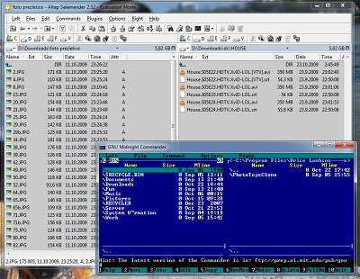

Title: Můj milovaný souborový manažer
Date: 2009-10-23 12:21:00
Tags: linux, software, windows

Včera jsem naznačil pomalou a postupnou konvergenci svých počítačových zvyků k Linuxu a hned se objevilo pár zajímavých témat k diskusi. Jsem rád, že se komentáře nezaplnily polemikou, ale spíš tipy na různé programy, které by mi mohly pomoci. Rád bych detailněji otevřel téma souborového manažeru.

Používám
[Altap (dříve Servant) Salamander](http://www.altap.cz/salam_cz/). Na Linuxu jsem vyzkoušel spoustu grafických manažerů, z KDE asi hlavně Krusader (protože KDE nemám rád a on jediný se zdál, že za to stojí), z GNOME spoustu nedodělků. Do konzolového mc jsem nikdy nepronikl, protože je konzolový a jeho interakce s okolním GUI je (téměř?) nulová. Na okénková-ikonková udělátka jsem si nezvykl ani ve Windows a pochybuji, že by měl některý z nich takovou auru, aby můj odpor k nim zlomil – jednoduše mi přijdou vrcholem nepřehlednosti.

Nedělám si zcela žádné iluze, že bych používal byť 2 % funkcí Salamanderu. Prošel jsem jeho nabídky a zkusil sepsat seznam věcí, které v něm dělám (a jak). Co tedy ve svém souborovém manažeru používám a plně si s tím vystačím:

-   Dvousloupcový formát je asi podmínkou. Okénka zvlášť s ikonkami jsou pro mě nepřehledná. Postupně se vysunující GUI (Mac OS) jsem v praxi nikdy nezkoušel.
-   Když píšu, hledám v aktuální složce.
-   Mohu označit adresář(e) tak, aby mi manažer spočítal a zobrazil jeho velikost.
-   Mohu řadit položky ve sloupci podle záhlaví sloupce (jméno, přípona, datum změny, velikost, …).
-   Na klávesové zkratce mám zobrazení/schování hidden souborů.
-   Pohyb po sloupcích hlavně klávesnicí (šipky nahoru dolů, enter, tab, backspace pro pohyb zpět – ten je důležitý… nevíte někdo jeho alternativu v mc? jsem bez něj jako bez ruk).
-   Umí mě přepínat mezi disky (C, D, mechaniky, karty, externí disky). Toto v Linuxu celkem odpadá.
-   Ukazuje mi kolik je na disku (v Linuxu dejme tomu „v aktuální složce“) místa.
-   Přejmenování jednoduchým dialogem, prosím nic ve stylu Rename/Move, já nikdy nevím co s tím mám dělat.
-   Funguje na zažité zkratky F3 view, F4 edit, F5 copy, F6 move, F7 mkdir, F8 delete (není nutné, používám klávesu delete… škoda že ta právě často nefunguje).
-   Umí zobrazovat a měnit atributy souborů.
-   Umí změnit velikosti písmen názvů souborů a přípon.
-   Umí překódovat soubory z různých kódových sad na jiné, případně umí konverzi konců řádků.
-   Síťové disky nepoužívám, ale měl by s nimi umět pracovat.
-   Měl by umět zálohovat svou konfiguraci :-) .

Tak. To byly takové základní věci. Teď věci, se kterými bude asi problém:

-   Umí spočítat dříve než začnu kopírovat, že na cílovém disku není dost místa a zeptá se mě, jestli chci přesto pokračovat.
-   Umí rekurzivně vyhledávat s wildcards/re­guláry, umí vyhledávat i v obsahu souborů. Když něco najde, ukáže mi kde to vůbec je a umí mě do dané složky rychle přesunout (v Salamanderovi ikonka Focus vyhledávacího dialogu), kromě toho, že soubor umí spustit i z vyhledávacího dialogu.
-   Má SFTP a FTP klienta. Klient musí být schopen držet si databázi uložených serverů i s hesly a jednotlivá uložená připojení musí jít parametrizovat (Passive Mode, LIST -a na vypsání hidden souborů, …).
-   Na klávese F3 je superrychlý a jednoduchý prohlížeč souborů, který si poradí s kódováním. Ale co navíc a bez čeho žít asi už nedokážu – po stisku F3 nad obrázkem mi zobrazí jeho náhled. To, pokud vím neumí v základní instalaci ani Total Commander a mě to vždycky hrozně všude strašně chybí. Spouštět obrázky přes enter prostě ne, to je pomalé. Já chci jen kouknout, co že to tam vlastně je (a nechci to vidět, když se zrovna záměrně nekoukám). Salamander takto umí zobrazit i MP3 (její ID3 tagy), PDF (nedokonale a trvá to) atd., ale moc to nepoužívám. Důležité jsou obrázky.
-   Umí otevřít ZIP, 7ZIP, RAR, ISO (obraz CD) a nekonečné množství dalších archivů jako úplně obyčejnou složku pro procházení, z níž lze cokoliv vykopírovat ven/dovnitř (rozbalit/zabalit) tak, jako když se pracuje s jinými složkami nebo soubory.

Hlavně FTP, prohlížeč obrázků a integrovaná podpora archivů jsou pro mě fakt důležité a jejich absence u jiných manažerů mi dělá hrozné problémy. Na druhou stranu si myslím, že to nejsou hloupé požadavky – tyto funkce mi opravdu šetří hromadu práce, protože s obrázky, archivy a FTP pracuji milionkrát denně. Předem upozorňuji, že oddelený FTP manažer používat nechci, externí prohlížeč po stisku na enter taky ne (vždy trvá věčnost než se spustí, i kdyby zde věčnost měla být sekunda) a externí archivátory už vůbec ne, to bych se naprosto zbláznil (nehledě na to, že s externími pitomostmi fungujícími jako WinZIP, WinRAR apod. bych si připadal jak v roce 1997).

Tak to je můj výčet funkcí. Nemyslím, že bych byl nějaký super-power-user. Jak říkám, z funkcí svého oblíbeného manažeru jich používám deset a mohlo by se zdát, že změna na jiný manažer nemusí být tak bolestivá. Jenže já žádný vyhovující za léta nenašel, takže jsem to vzal tak, že jestli chci na Linux, musím masochisticky přejít na mc a všechny věci, které Salamander dělá za mě, se naučit psát do příkazové řádky. Rozmluvíte-li mi to, budu jen rád.

Když už otvírám téma souborového manažeru, říkám si, že dříve to byl jasný „operační systém operačního systému“. Podle mě dříve lidé nejvíce času trávili právě se souborovým manažerem a orientace v souborech pro ně znamenala hodně. Dnes mají lidé vyhledávání, knihovny a všelijaká udělátka, která je podporují v bordelářství a na uspořádání souborů nikdo nehledí. Naopak, když má uživatel něco na souborové bázi najít, děsí se toho, protože má většinou akorát nějaký obrovitý chuchvalec složek, obrázků, dokumentů a empétrojek v *My Documents*. A tím programem, kde trávíme nejvíc času, se stal internetový prohlížeč.