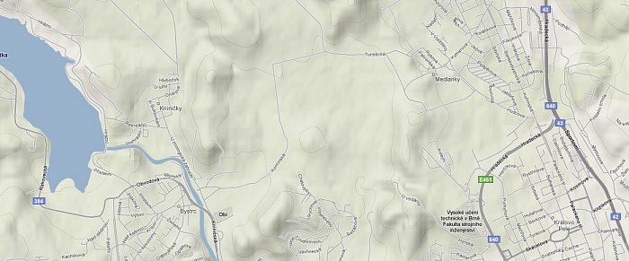
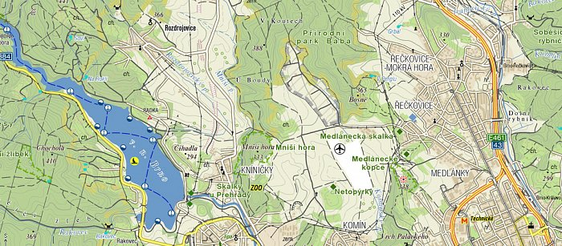
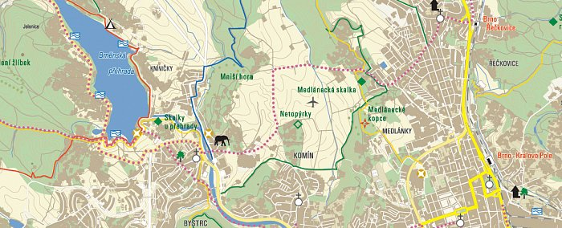

Title: API k českým turistickým mapám
Date: 2010-01-22 00:00:00
Tags: net, projekty, sport, vut fit, webdesign
Draft: true

*Článek vyšel na serveru [Zdrojak.cz](http://zdrojak.root.cz/clanky/api-k-ceskym-turistickym-mapam/). Volně vychází z [mé bakalářské práce](http://blog.javorek.net/bakalar/).*

Zdá se, že český trh s mapovými službami je poměrně stabilizovaný a nic převratného se, kromě zavádění Google Street View, neděje. Pojďme se tedy společně podívat, co nám, webovým vývojářům, současný stav nabízí a jaké máme vlastně možnosti, chceme-li psát aplikace pro Českou republiku využívající turistické mapové podklady.

## Trocha historie neuškodí

V oblasti mapových technologií na internetu proběhl před několika lety opravdový zlom. Vše začalo 8. 2. 2005, kdy Google [spustil](http://googleblog.blogspot.com/2005/02/mapping-your-way.html) své revolučně zpracované interaktivní Google Maps. V řetězové reakci si postupně i další provozovatelé online map začali uvědomovat skrytý potenciál této služby (prodej regionální reklamy, cílená reklama, partnerství s jízdními řády apod.) a začali také investovat velké částky do její modernizace. Na českém internetu vznikly časem dva velké a velmi kvalitní mapové servery, což je ve světě celkem ojedinělý úkaz, přihlédneme-li k velikosti a významu naší země.

Ještě v roce jejich vydání představil Google (jako první) u svých map aplikační rozhraní pro použití mapových podkladů i na jiných webech. Vydání API se setkalo s [obrovským ohlasem](http://maps.google.com/help/maps/casestudies/) a nadobro změnilo podobu webu. Po celém internetu se začaly objevovat interaktivní mapy – od jednoduchých orientačních výřezů po aplikace na mapách kompletně založené. Konkurence odpověděla svými vlastními API.

Ačkoliv od vydání prvních mapových API uplynulo pět let, tedy *půlstoletí digitálního světa*, o aktuálním stavu služeb se moc nehovoří. Popišme si tedy specifika, výhody a nevýhody jednotlivých mapových API tak, jak je známe dnes. Je nutné podotknout, že samotných mapových serverů je mnohem více (např. Mapy iDNES.cz, Yahoo Maps, Ask.com Maps & Directions, Multimap, NAVTEQ Map24, Bing Maps, aj.), ale nepovažoval jsem jejich přínos za dostatečně relevantní pro tento článek, jelikož poskytované datové podklady nejsou dostatečné pro Českou republiku a API vůbec nenabízejí, nebo má velmi omezené možnosti.

## Proč zrovna turistické mapy?

Přiznejme si, že pokud chceme postavit aplikaci využívající mapy, nejspíše bezmyšlenkovitě sáhneme po Google Maps. Mají nejpropracovanější API s nejjistější budoucností, a Google je už v České republice dostatečně aktivní na to, aby k němu i český vývojář měl trochu důvěry. Aktuálnost mapových podkladů je napříč spektrem poskytovatelů srovnatelná, a ty od Google jsou prostě dobré a pro většinu aplikací dostačující. Už ani v oblasti integrace map s místními službami nemají zdejší poskytovatelé moc výrazný náskok. Na mapách od celosvětového giganta totiž dnes najdeme i tu poslední tramvajovou zastávku nebo hospodu za rohem, tedy věci, jež jsme ještě před pár lety mohli najít jen na službách vyvíjených v ČR.

Chceme-li však programovat aplikaci zaměřenou na turistiku, cyklistiku nebo jakýkoliv jiný sport a naším záměrem tedy bude mít kvalitní turistické mapy, staneme na rozcestí. Brzy totiž zjistíme, že nabídka Google Maps je v tomto směru poměrně tristní a domácí hráči, kteří by z takové mezery mohli těžit, sice něco mají, ale to něco není vůbec takové, jaké bychom si to představovali. Vzhledem k možnému komerčnímu využití cílové skupiny uživatelů to je velká škoda – Češi jsou národ sportovců a turistů a alternativy k zahraničním projektům jako např. [MapMyRun.com](http://www.mapmyrun.com/) zde prostě chybí.

## Google Maps

Začněme průkopníkem v oblasti online map. Mapový server i API samozřejmě nabízí již hodně dlouho, takže jeho služby jsou v mnoha směrech nejvyzrálejší. API je neustále vyvíjeno a pracuje se na
jeho [třetí verzi](http://code.google.com/intl/cs/apis/maps/documentation/v3/).

Není dobré se však nechat unést jeho možnostmi. Je nutné zaměřit se i na jiné rysy, důležité pro náš záměr. Mezi takové patří například skutečnost, že do češtiny začala být služba lokalizována až [nedávno](http://www.lupa.cz/clanky/mapy-google-v-cestine-realita-nebo-zbozne-prani/). Dnes je již sice míra integrace map do českého prostředí na velmi dobré úrovni, ale z hlediska mapových podkladů má jednu velkou, již zmíněnou mezeru – turistická data. Google poskytuje mapy globálně a proto se mu v nich velmi špatně odráží specifika jednotlivých zemí. K dispozici jsou sice terénní mapy s vrstevnicemi, ale neexistuje možnost zobrazit na nich české turistické trasy a cyklostezky.

Jinak jsou podklady kvalitní, i když někdy méně přesné, než u lokálních mapových služeb. Google používá kombinaci několika zdrojů geografických map, přičemž většinu českých podkladů získává od dodavatele GEODIS Brno. Předností map je samozřejmě dostupnost podkladů pro celý svět a lákavá je rovněž představa možného budoucího napojení aplikace např. v podobě vrstvy na program Google Earth.

## Mapy.cz

Mapy.cz byly prvním ryze českým projektem v oblasti nových online map a dodnes jsou lídrem lokálního trhu. Stejně jako za Google Maps stojí i za těmito mapami silná společnost. Budoucnost serveru a případný další vývoj API je celkem jistý. Seznam.cz se na rozdíl od všech ostatních českých portálů profiloval po vzoru Google spíše do společnosti, jež svou budoucnost spojuje s technologickým pokrokem, než do mediálního vydavatelství jako například Centrum Holdings. Odhadnutelné záměry potvrdili nedávným uveřejněním zprávy o [vývoji nového API](http://mapy.cz.sblog.cz/2009/02/18/29).

Současný stav API je ale celkem nešťastný. Aplikační rozhraní nabízí jen omezenou škálu funkcí, omezené mapové podklady oproti službě Mapy.cz a samotná práce s funkcemi API působí na vývojáře poněkud těžkopádně. Jeho licenční podmínky navíc nejsou tak volné jako u ostatních API a požadují registraci klíče nikoliv na doménu, ale přímo na unikátní URI, kde se má mapa nacházet. To jej pro tvorbu složitější aplikace prakticky vyřazuje ze hry. V podmínkách je také omezení na 1000 zobrazení denně a zákaz provozu map pro komerční užití, což v rané fázi projektu není velkou překážkou, ale pro budoucí rozvoj projektů ano.

Nové API čtvrté verze vyvíjí v Seznam.cz Ondřej Žára, autor povedeného nástroje pro tvorbu databázových schémat, [WWW SQL Designer](http://code.google.com/p/wwwsqldesigner). Bohužel rozhraní je zatím stále dost nestabilní a podle autorových
slov v [diskusi](http://forum.lide.cz/forum.fcgi?akce=forum_data&forum_ID=86016&auth=) ani jemu stále ještě nejsou známy nové licenční podmínky. Ve výše zmíněné diskusi postupně přibývají oznámení o nových funkcích, takže se možná nového API jednou opravdu dočkáme. Kdy to však bude a za jakých podmínek bude k dispozici, to zatím nikdo neví.

Mapy.cz jsou připraveny kombinací geografických dat od PLANstudio a GEODIS Brno. Turistická mapa je nejkvalitnější podobnou mapou na českém internetu – za její asi nejpodstatnější nevýhodu by se dala chápat absence velkého měřítka (turistickou mapu lze, na rozdíl od té na Amapy.cz, přiblížit jen do poměrně omezených podrobností). Seznam.cz ji poskytuje na základě dat společnosti SHOCart, která je známa svými papírovými turistickými a cyklistickými publikacemi. Je škoda, že nepoužitelné API v tomto případě brání využít tak kvalitní podklady.

## Amapy.cz

Amapy.cz se na svět dostaly v roce 2006 pod hlavičkou portálu Atlas.cz. Ihned po [představení](http://management.blog.lupa.cz/2006/11/05/spetka-koreni-ze-zakulisi-projektu-novych-atlasich-map/) bylo jasné, že se s nimi musí na českém trhu počítat – zpracování bylo profesionální a spolu s mapami přišlo i první, na funkce bohaté, dobře dokumentované české mapové API. Vývoj však postupně ustával a po tom, co byl Atlas.cz sjednocen s Centrum.cz pod hlavičku Centrum Holdings, nelze již kolem API pozorovat vůbec žádnou činnost ze strany provozovatele. Celou službu původně zpracoval Daniel Steigerwald, který mé doměnky [de facto potvrdil](http://twitter.com/steida/statuses/2211073537).

API je však opravdu velmi dobře použitelné a mapové podklady kvalitní, připravené ve spolupráci s firmou DPA. I přes API lze dokonce zobrazovat vrstvy s turistickými a cyklistickými značkami a už i zcela základní mapa disponuje vrstevnicemi. Aplikační rozhraní nabízí funkce, jež nelze najít ani u Google Maps API a podporuje několik souřadnicových systémů naráz, což je výhodné při spolupráci s jinými službami (každá požaduje body v jiném formátu).

Specifikem API je integrovaný JavaScriptový framework MooTools 1.11. Výhodou je, že po vložení API do stránky lze přímo využít všech výhod frameworku a není nutné nějaký připojovat dodatečně. Nevýhodou je nemožnost vlastního výběru frameworku a také ustrnutí vývoje API, protože v důsledku toho nebyl průběžně framework obnovován a zůstal v API ve verzi 1.11, ačkoliv nedávno byly MooTools vydány již ve velmi odlišné verzi 1.2.4. Jiným zářným příkladem zastarání budiž kompatibilita s Internet Explorerem 8. O tom nemá původní kód API nejmenší tušení, takže se jeho funkčnost musí řešit přes [meta tag s *X-UA-Compatible*](http://zdrojak.root.cz/clanky/tri-zobrazovaci-mody-internet-exploreru-8/).

## Otevřený projekt OpenStreetMap

OpenStreetMap je otevřený projekt, který se snaží vytvořit volně dostupná geografická data. Získává je integrací dat z různých zdrojů a především individuálním sběrem dat pomocí GPS zařízení. Mnoho institucí, organizací a dokonce i firem uvolnilo svá data pod licencí kompatibilní s OpenStreetMap, aby tomuto projektu pomohli.

Kvalita mapových podkladů pro ČR však není zrovna nejlepší a pro účely aplikace, která to se svým záměrem myslí vážně, se moc nehodí ani forma jejich zobrazení. Mapy sice obsahují například polohu sloupů elektrického vedení nebo přesné hranice lesů, jenže vrstevnice nebo turistické značky a cyklostezky nepodporují.

OpenStreetMap je zajímavý počin a do budoucna možná perspektivní, ale jeho nasazení v aplikaci se nedá příliš doporučit. Je uveden pro úplnost jako zajímavý alternativní a otevřený zdroj geografických dat, jenž by v budoucnosti mohl nabýt na relevanci.

## Vyhlídky

Jak je naznačeno v úvodních odstavcích, v oblasti turistických map je to takové nešťastné. Google Maps nám nabízí možnosti, o jakých jsme ani nesnili, ale v podkladech najdeme jen zeleně podbarvené vrstevnice. Seznam.cz sice vyvíjí perspektivní API, ale kdy bude vydáno a za jakých podmínek, to nevíme. To současné je pro reálný projekt v podstatě nepoužitelné. Amapy.cz by svými funkcemi a dobrými podklady měly situaci zachraňovat, ale když se na API podíváme blíž, zjistíme, že z jeho dokumentace musíme sfouknout prach a mezi zdánlivě nablýskanými ovládacími prvky mapy musíme vymést pavučiny.

Současné aplikace většinou používají Google Maps a spoléhají se, že uživatelům bude stačit ortofotomapa. Území Česka a Slovenska má ale [jednu z nejdokonalejších a nejhustších sítí turistického značení](http://www.klubturistu.cz/turisticke-znaceni) a tyto trasy jsou bez diskuse něčím, co nesmí na takto cílených mapách chybět. Podobné značení má také Polsko, ale jinak je takováto síť světově unikátní. Pokud chceme poskytovat možnost zobrazení těchto tras, musíme tedy využít lokálního poskytovatele. Jejich současná řešení však na seriózně míněný projekt použít nelze.

Světlo na konci tunelu můžeme spatřovat v API od Seznam.cz. Nepovažuji za pravděpodobné, že by Google začal podporovat české turistické značení a nemyslím si, že Centrum Holdings bude investovat do nového mapového API. Dokud nebudou dostupné plnohodnotné české turistické mapy, budou provozovatelé projektů v bezvýchodné situaci a uživatelé svázáni možnostmi současných Google Maps. Nevzniknou žádné české startupy a cílová skupina se nepřestane přesouvat k celosvětovým službám, které sice nemají ani to turistické značení, ani nehovoří česky, ale nabízí stejné mapy (Google) a navrch existující komunitu, prověřené zázemí a propracované funkce. Ujede nám zase vlak?

*[Diskuse k článku](http://zdrojak.root.cz/clanky/api-k-ceskym-turistickym-mapam/nazory/) se nachází na serveru Zdrojak.cz.*